##  Hey there!

## 👨‍💻 &nbsp; About me

🔭 &nbsp; I'm a PostDoc working on inverse design of mechanical metamaterials, material instabilities, and wave propagation.\
👨‍🎓 &nbsp; I have a PhD in _Solid and Structural Mechanics_ from the _University of Trento (Italy)_.\
🌱 &nbsp; I’m currently trying to fit 72 hours within a day 😜.\
💬 &nbsp; Ask me about Mathematica/MATLAB/Python programming, FEM, or anything related to my research 😉.\
🆓 &nbsp; In my free time, I like to expand my coding skills 💻, bike around 🚲, hike around ⛰️, and play beach volleyball 🏐.\
🧾 &nbsp; You can check out my [CV](https://giovannibordiga.com/assets/pdf/CV_full.pdf) for more details about my research.\
📫 &nbsp; Feel free to reach out via [email](mailto:gbordiga@seas.harvard.edu).\
⚡ &nbsp; Fun fact: I ❤️ .

## :octocat: &nbsp; GitHub Stats

  
  

